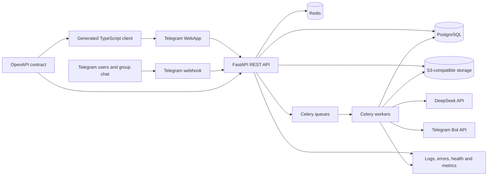
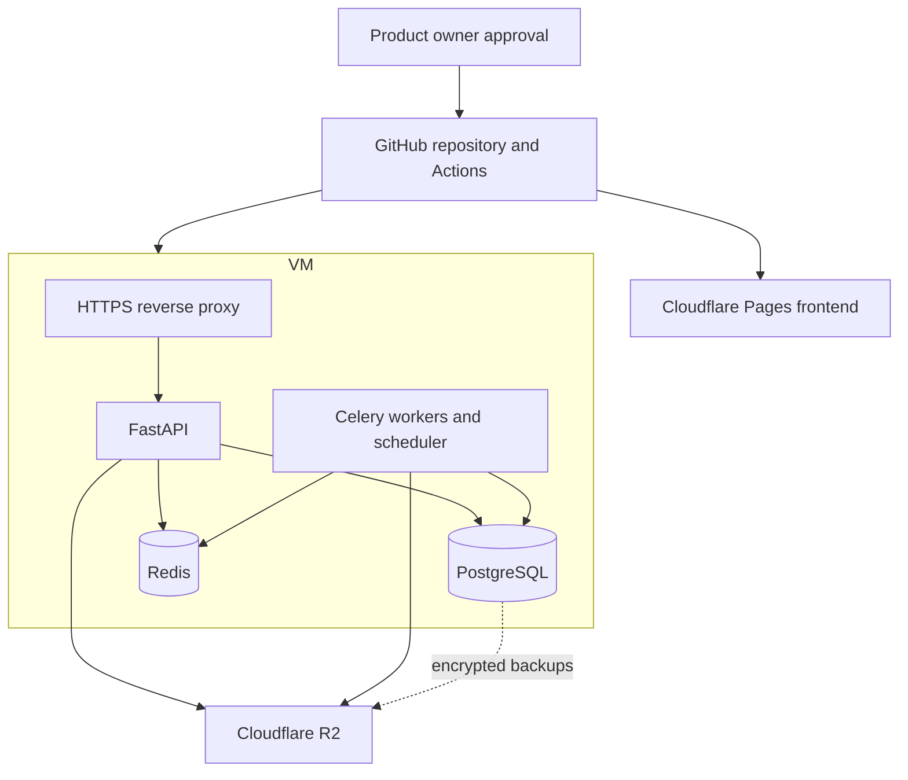

# System overview

Status: approved foundation for Module 1

## Deployment topology for the free pilot

## Trust boundaries

- Telegram WebApp identity is verified by the backend; client-supplied identity is never trusted directly.
- Telegram webhook authenticity and secret path/header are checked before ingestion.
- DeepSeek receives only the minimum context required for the task.
- Payment provider callbacks are verified and idempotent.
- Object-storage access is private by default and uses time-limited access where needed.
- Production databases and Redis are not exposed publicly.
